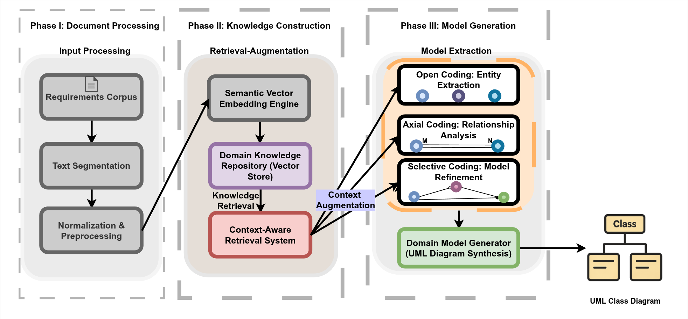

# QuaRUM

A framework for automatically extracting UML domain models from natural language requirements using Qualitative Data Analysis (QDA) and Retrieval-Augmented Generation (RAG).

## Overview

QuaRUM (Qualitative Data Analysis-Based Retrieval Augmented UML Domain Model) implements the three-phase coding process from grounded theory (open coding, axial coding, and selective coding) with large language models to analyze requirements documents. The framework uses retrieval augmentation to ground each modeling decision in source text, improving accuracy and reducing hallucinations.



The framework extracts:

- Classes, interfaces, and enumerations
- Attributes and methods
- Relationships and hierarchies
- Actors and their interactions

## Features

- Implements QDA coding process (open, axial, and selective coding)
- Uses RAG to ground modeling decisions in source text
- Achieves F1-scores between 0.85-0.98 and Cohen's κ up to 0.92
- Provides 218% ROI for initial use, increasing to 1,131% for subsequent uses
- Generates PlantUML diagrams and traceability reports
- Reduces manual effort while improving consistency

## Installation

```bash
# Clone the repository
git clone https://github.com/SyedTauhidUllahShah/QuaRUM.git
cd QuaRUM

# Install the package
pip install -e .
```

## Requirements

- Python 3.8+
- OpenAI API key

## Architecture

QuaRUM consists of three main processing phases:

1. **Document Processing**: Ingests, cleans, segments, and normalizes requirements documents
2. **Knowledge Construction**: Creates semantic vector embeddings to support context-aware retrieval
3. **Model Generation**: Implements the three QDA phases
   - Open Coding: Extracts domain entities and their attributes
   - Axial Coding: Identifies relationships between entities
   - Selective Coding: Refines the model structure and resolves inconsistencies

## Usage

### Command-line Interface

```bash
# Set your OpenAI API key
export OPENAI_API_KEY=your-api-key

# Run domain modeling on a requirements file
quarum --file path/to/requirements.txt --description "E-commerce system for managing products, orders, and customers"
```

### Python API

```python
from quarum.pipelines.domain_modeling import DomainModelingPipeline

# Initialize pipeline
pipeline = DomainModelingPipeline(api_key="your-openai-key")

# Execute pipeline
result = pipeline.execute(
    file_path="requirements.txt",
    domain_description="E-commerce system for selling products",
    output_dir="models"
)

# Access results
print(f"Success: {result.success}")
print(f"Entities: {result.metrics['final_entity_count']}")
print(f"Relationships: {result.metrics['final_relationship_count']}")
print(f"UML diagram saved to: {result.outputs['plantuml_file']}")
```

### Example Script

```bash
python examples/simple_modeling.py --file requirements.txt --domain "E-commerce system" --api-key your-openai-key
```

## Implementation Details

QuaRUM uses:

- LangChain for orchestration
- OpenAI (GPT-4o-mini) for entity extraction and relationship analysis
- FAISS for vector storage and similarity search
- RecursiveCharacterTextSplitter for document segmentation
- OpenAIEmbeddings for semantic embedding
- PlantUML for UML diagram generation

## Dataset Organization

```txt
quarum/
├── data/                        # Data directory (for datasets)
│   ├── requirements/            # Raw input requirements documents
│   │   ├── ecommerce/
│   │   ├── healthcare/
│   │   └── banking/
│   ├── models/                  # Generated models (output)
│   │   ├── ecommerce/
│   │   ├── healthcare/
│   │   └── banking/
│   └── benchmarks/              # Reference models for evaluation
```

Requirements text files should be placed in the appropriate subdirectory under `data/requirements/`. Model outputs will be saved to `data/models/`.

## Customization

Settings can be customized through the Settings class:

```python
from quarum.config.settings import Settings

settings = Settings()
settings.set("llm", "model_name", "gpt-4o-mini")
settings.set("output", "diagram_style", "vibrant")
settings.set("document", "chunk_size", 1000)
settings.set("document", "chunk_overlap", 200)
```

## Evaluation Results

QuaRUM has been evaluated on three case studies:

- Library Management System (LMS)
- Personalized Learning Platform (PLP)
- Smart Home IoT Control Hub (SMIoT)

### Performance Metrics

| Task                   | F1-Score Range | Cohen's κ Range |
|------------------------|----------------|----------------|
| Entity extraction      | 0.90-0.95      | 0.86-0.92      |
| Relationship identification | 0.87-0.92    | 0.83-0.89    |
| Overall model quality  | 0.89-0.94      | 0.85-0.90      |

### Economic analysis

- First project ROI: 218%
- Subsequent project ROI: 1,131%
- Significant reduction in modeling errors compared to manual QDA

## Citation

If you use QuaRUM in your work, please cite our paper:

```bibtex
@article{shah2025quarum,
  title={QuaRUM: Qualitative Data Analysis-Based Retrieval Augmented UML Domain Model from Requirements Documents},
  author={Shah, S.T.U. and Hussein, M. and Barcomb, A. and Moshirpour, M.},
  year={2025}
}
```
