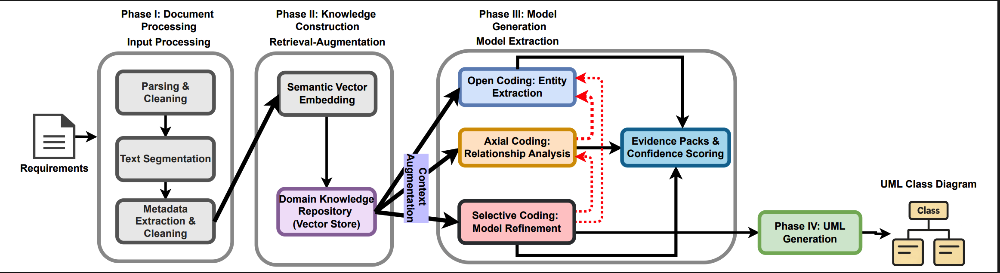

# QuaRUM

**QDA-based Retrieval-Augmented UML Domain Model generation from requirements documents.**

QuaRUM automates the complete three-phase Qualitative Data Analysis (QDA) process, open coding, axial coding, and selective coding, within a retrieval-augmented pipeline, transforming unstructured requirements documents into evidence-grounded UML class diagrams. Manual QDA-based domain modeling is methodologically rigorous but does not scale to industrial practice. Fully manual analysis of three industrial-scale requirements corpora required 342.9 person-hours of independent coding plus 63.2 person-hours of coordination and inter-rater reconciliation. QuaRUM closes this gap by embedding LLM capabilities inside a structured pipeline that preserves the four invariants that give QDA its value:

| Requirement | Description |
|---|---|
| **R1** – Evidence grounding | Every model element is traceable to a specific passage in the source text |
| **R2** – Phase fidelity | Open, axial, and selective coding remain procedurally distinct and separately inspectable |
| **R3** – Decision transparency | The rationale for each modeling decision is recorded via confidence scores and evidence packs |
| **R4** – Traceability | Explicit links between model elements and source requirement passages are preserved throughout |

---

## Architecture

QuaRUM is organized into four sequential phases.



### Confidence scoring

Every candidate entity, attribute, operation, and relationship is scored independently from the component that proposed it. Four signals are combined using phase-specific weights:

| Signal | Description |
|---|---|
| **E** – Exact text match | Required terms appear verbatim in quoted evidence |
| **F** – Facet coverage | Fraction of required structural information with direct textual support |
| **R** – Retrieval support | Mean cosine similarity of supporting segments (normalized to [0,1]) |
| **C** – Cross-segment consistency | Fraction of top-k segments that corroborate the claim |

Phase-specific formulas (acceptance threshold τ = 0.70):

```
score_open   = clip(0.50·E + 0.30·F + 0.15·R + 0.05·C)
score_axial  = clip(0.35·E + 0.35·F + 0.15·R + 0.05·C + 0.10·S)
score_sel    = clip(0.70·score_prior + 0.30·U)
```

where S = structural compatibility (directionality + type) and U = fraction of UML conformance checks passed.

---

## Evaluation Results

Evaluated on three industrial-scale corpora from the [PURE dataset](https://doi.org/10.5281/zenodo.1414117): Library Management System (LMS), Personalized Learning Platform (PLP), and Smart Home IoT Control Hub (SMIoT).

### Entity extraction 

| Corpus | Precision | Recall | F1 | Accuracy | κ |
|---|---|---|---|---|---|
| LMS | 0.96 | 0.94 | 0.95 | 0.95 | 0.91 |
| PLP | 0.94 | 0.96 | 0.95 | 0.96 | 0.92 |
| SMIoT | 0.91 | 0.89 | 0.90 | 0.92 | 0.86 |
| **Average** | **0.94** | **0.93** | **0.93** | **0.94** | **0.90** |

Average κ of 0.90 exceeds the average final inter-coder agreement of 0.85 observed between the two human analysts.

### Attribute extraction

| Corpus | Precision | Recall | F1 | Accuracy | κ |
|---|---|---|---|---|---|
| LMS | 0.91 | 0.87 | 0.89 | 0.92 | 0.85 |
| PLP | 0.90 | 0.89 | 0.90 | 0.93 | 0.86 |
| SMIoT | 0.88 | 0.85 | 0.86 | 0.90 | 0.82 |
| **Average** | **0.90** | **0.87** | **0.88** | **0.92** | **0.84** |

QuaRUM also identified 37 valid attributes and 18 valid operations that neither human analyst included in their initial codebooks; both were independently confirmed against the source text.

### Relationship identification 

| Corpus | Precision | Recall | F1 | Accuracy | κ |
|---|---|---|---|---|---|
| LMS | 0.93 | 0.92 | 0.92 | 0.94 | 0.89 |
| PLP | 0.92 | 0.90 | 0.91 | 0.93 | 0.87 |
| SMIoT | 0.89 | 0.85 | 0.87 | 0.90 | 0.83 |
| **Average** | **0.91** | **0.89** | **0.90** | **0.92** | **0.86** |

Directionality accuracy: 0.90 avg (κ = 0.86). Multiplicity accuracy: 0.85 avg (κ = 0.80).

### Selective coding impact 

| Corpus | F1 (w/o) | κ (w/o) | F1 (with) | κ (with) | ΔF1 | Δκ |
|---|---|---|---|---|---|---|
| LMS | 0.85 | 0.84 | 0.94 | 0.90 | +0.09 | +0.06 |
| PLP | 0.89 | 0.80 | 0.93 | 0.89 | +0.04 | +0.09 |
| SMIoT | 0.79 | 0.78 | 0.89 | 0.85 | +0.10 | +0.07 |
| **Average** | **0.84** | **0.81** | **0.92** | **0.88** | **+0.08** | **+0.07** |

Selective coding resolved 41 structural UML violations and added 112 validated model enrichments (45 attributes, 30 operations, 37 relationships). Issue resolution rate: 95.2%.

---

## Installation

```bash
pip install -r requirements.txt
```

Requires Python 3.10+. Set your OpenAI API key in a `.env` file:

```
OPENAI_API_KEY=sk-...
```

---

## Usage

### Single document

```bash
python main.py --input dataset/Iot.txt
```

### Directory of documents

```bash
python main.py --input_dir dataset/
```

### Resume from a checkpoint

Each phase saves its output automatically. Use `--resume-from` to skip completed phases:

```bash
# Skip Phase I (load segments from checkpoint)
python main.py --input dataset/Iot.txt --resume-from 2

# Skip Phases I–II (load vector store from checkpoint)
python main.py --input dataset/Iot.txt --resume-from 3

# Skip Phases I–III (regenerate UML only)
python main.py --input dataset/Iot.txt --resume-from 4
```

| Flag | Behavior |
|---|---|
| `--resume-from 1` | Full run from scratch (default) |
| `--resume-from 2` | Load Phase I from checkpoint, run Phases II–IV |
| `--resume-from 3` | Load Phases I–II from checkpoint, run Phases III–IV |
| `--resume-from 4` | Load Phases I–III from checkpoint, run Phase IV only |

### Verbose logging

```bash
python main.py --input dataset/Iot.txt --verbose
```

### Python API

Run the full pipeline on a single document:

```python
from pipeline import QuaRUMPipeline

pipeline = QuaRUMPipeline()
bundle = pipeline.run("dataset/requirements.txt")

print(f"Entities:      {len(bundle.model.entities)}")
print(f"Relationships: {len(bundle.model.relationships)}")
```

Resume from a specific phase (skips earlier phases, loads from checkpoints):

```python
# Resume from Phase III (skips segmentation and vector store rebuild)
bundle = pipeline.run("dataset/requirements.txt", resume_from=3)
```

Iterate over multiple documents programmatically:

```python
import glob
from pipeline import QuaRUMPipeline

pipeline = QuaRUMPipeline()

for path in sorted(glob.glob("dataset/*.txt")):
    bundle = pipeline.run(path)
    print(f"{path}: {len(bundle.model.entities)} entities, "
          f"{len(bundle.model.relationships)} relationships")
```

Access evidence and confidence scores for any model element:

```python
# Quoted source spans per entity
for entity in bundle.model.entities:
    spans = bundle.evidence.get(entity.name, [])
    print(f"{entity.name}: {[s.text for s in spans]}")

# Confidence scores
for entity in bundle.model.entities:
    print(f"{entity.name}: {bundle.confidence[entity.name]:.2f}")

# Relationship confidence
for rel in bundle.model.relationships:
    key = f"{rel.source}__{rel.relationship_type.value}__{rel.target}"
    print(f"{key}: {bundle.confidence[key]:.2f}")
```

---

## Output

All outputs are written under `output/`:

```
output/
├── bundles/          # ModelBundle JSON (entities, relationships, evidence, confidence)
├── plantuml/         # .puml diagrams and optional .png renders
├── vector_store/     # FAISS index per document
├── checkpoints/      # Per-phase checkpoints for resume
│   └── <doc_name>/
│       ├── phase1_segments.json
│       ├── phase2_vectorstore/
│       ├── phase3a_entities.json
│       ├── phase3b_relationships.json
│       ├── phase3c_entities.json
│       └── phase3c_relationships.json
└── logs/
    └── quarum.log
```

The `ModelBundle` (`B = (M, E, C, S)`) contains:
- **M** — UML model (entities + relationships)
- **E** — evidence mapping: element name → quoted source spans
- **C** — confidence scores: element name → float
- **S** — segmentation metadata: segment ID → document location

---


## Configuration

Key parameters in `config.py`:

```python
LLM_MODEL = "gpt-5-nano"
LLM_TEMPERATURE = 0.3
CONFIDENCE_THRESHOLD = 0.70        # acceptance threshold for all phases
RETRIEVAL_TOP_K = 5                # retrieved segments per query
ENTITY_MERGE_NAME_SIMILARITY = 0.85  # merge threshold for near-duplicate entities
CONVERGENCE_ENTITY_RATE = 0.05     # <5% new entities per iteration
CONVERGENCE_RELATIONSHIP_CHANGE = 0.10
CONVERGENCE_CONFIDENCE_DELTA = 0.05
CONVERGENCE_CONSECUTIVE_STABLE = 2
SELECTIVE_MAX_ITERATIONS = 10
```

---

## Citation

If you use QuaRUM in your research, please cite:

```bibtex
@article{tauhid2026quarum,
  title     = {QuaRUM: qualitative data analysis-based retrieval-augmented UML domain model from requirements documents},
  author    = {Tauhid Ullah Shah, Syed and Hussein, Mohamad and Barcomb, Ann and Moshirpour, Mohammad},
  journal   = {Automated Software Engineering},
  volume    = {33},
  number    = {2},
  pages     = {44},
  year      = {2026},
  publisher = {Springer}
}
```

## Contact

- **Syed Tauhid Ullah Shah** — University of Calgary · [syed.tauhidullahshah@ucalgary.ca](mailto:syed.tauhidullahshah@ucalgary.ca)
- **Mohammad Hussein** — University of Calgary · [mohamad.hussein@ucalgary.ca](mailto:mohamad.hussein@ucalgary.ca)

---

## License

[Creative Commons Attribution 4.0 International (CC BY 4.0)](https://creativecommons.org/licenses/by/4.0/)